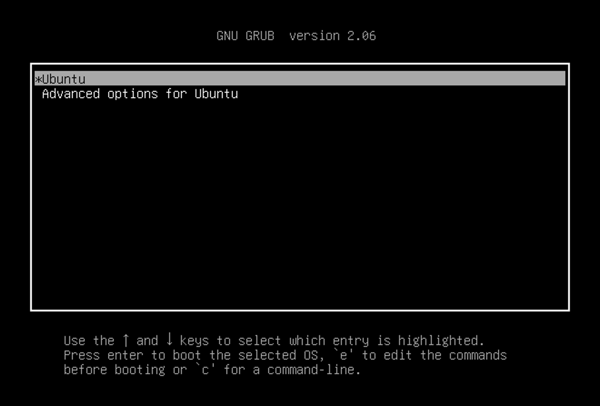

# Task 2: Build and Install Linux Kernel

!!! Warning

    If you are using the course-provided server, kindly perform this task within your VM.
    **At no point should you attempt to install the kernel built by yourself directly in the server.**

## Fetch the kernel source code

To access the Linux kernel releases, visit the official website at <https://www.kernel.org>.
These releases fall into several main categories: mainline, stable, and long-term.
For more information on the different categories, please check
[this page](https://www.kernel.org/category/releases.html).

In this semester, we will work with the latest stable release when the course begins, which is Linux 6.12.9.
You can find the repository for the mainline tree at
<https://git.kernel.org/pub/scm/linux/kernel/git/torvalds/linux.git>
and the repository for the stable tree at
<https://git.kernel.org/pub/scm/linux/kernel/git/stable/linux.git>.

To obtain a local copy of the code, we have two options:

1. Download a release.
2. Clone the repository.

You can choose the method that best suits your needs, as different tasks may require different approaches.

### Clone the tree

To work with Linux kernel sources and perform tasks such as generating a patch, you'll need to clone the git tree.
Use the following command to clone the repository:

```bash
git clone https://git.kernel.org/pub/scm/linux/kernel/git/stable/linux.git --depth 1 --branch v6.12.9
```

Here's what each option does:

- `--depth 1`:

  Creates a shallow clone with the history truncated to only one commit, reducing the size of downloaded git objects.

- `--branch xxx`:

  Specifies the branch (or tag) to clone.

### Download kernel source code

To download a kernel source code release, visit this link: <https://cdn.kernel.org/pub/linux/kernel/v6.x/linux-6.12.9.tar.xz>.

All kernel releases are cryptographically signed.
To ensure the integrity of your downloaded kernel releases, follow the instructions provided [here](https://www.kernel.org/category/signatures.html).

### Check the version

Execute the following command to check which version you currently have:

```
make kernelversion
```

If you obtained the kernel source code by cloning the repository, you may also check the commit history:

```console
git log -1
```

## Build and install the kernel

!!! Info "Additional dependencies"

    In this part, you may encounter errors like:

    - Command not found: `xxx`
    - Unable to find `xxx` package
    - ...

    This indicates that specific programs, libraries, or headers are missing on your machine.
    You'll need to install the necessary dependencies.
    Typically, this involves installing Ubuntu software packages required for kernel building.
    As you continue, you'll become more comfortable with this process.

### Configure the kernel

There are several ways to configure the kernel.
You can choose one of the following methods:

- **`make defconfig`**

   This command creates a default configuration file for the kernel.
   The default configuration is a good starting point, but you may want to customize it further.

- **`make menuconfig`**

   This command opens a menu that allows you to customize the kernel configuration.
   If there is no configuration file in the current directory, the command will create a new one based on the configuration of the kernel currently running on your machine.
   It is recommended to use this method if you are not using VirtualBox.

You can check other configuration options by running `make help`.

### Build and install linux kernel

1. **`make -j$(nproc)`**

   Compiling the kernel is a time-consuming task.
   The `-j` option specifies the number of jobs to run simultaneously.
   The `nproc` command returns the number of processing units available to the current process.
   By running multiple jobs in parallel, you can speed up the compilation process.
   However, be careful not to overload your machine with too many jobs, as this can cause it to hang.

   Depending on your machine’s specifications, the compilation process may take 10–20 minutes, but YMMV.
   While you wait, you can consider ways to optimize the process for future builds.

2. **`make modules_install`**

   This command is used to install kernel modules.

3. **`make install`**

   This command installs the newly built kernel.
   It's the final step in getting your custom kernel ready for use.
   Please try to find out which directory the kernel image is installed to.

## Configure GRUB

The kernel image is now in the correct location.
However, the bootloader might not be aware of it yet.

The boot order of the operating systems is specified in `/boot/grub/grub.cfg`.
By updating this file, you can modify the default OS, the sequence of different kernel releases, and the behaviour of the GRUB menu.

Try to figure out how to update this file (or how the file is updated).
The original settings in related files and some online research will be very helpful.
Please note that root privileges are required for this step.

If this is your first time performing this operation, it is recommended to create a backup or snapshot before proceeding.

After rebooting, check whether the boot option appears as expected.

!!! info

    By default, the GRUB menu is hidden.
    You can press and hold the `Shift` key during boot to display the menu.
    You can also change the default behaviour by modifying the GRUB configuration file.



If everything goes well, you should see the login prompt.
After logging in, some messages (motd) will be printed out.
The kernel release version, which should have changed to the new one, is reflected in the first line.

It is expected that the new kernel will start up without any problems if you follow the instructions correctly.
If something does go wrong, check the error messages and try to figure out what caused the issue.
You may ask your friends or the TA for help if you get stuck at this step.

## Customize the kernel build

In this task, you will build a smaller kernel image that will successfully boot up on your virtual machine.
You can do so by customizing the kernel configuration and removing unnecessary features.

### menuconfig

To customize the kernel configuration, you may use the `menuconfig` tool.

```
make menuconfig
```

This command will open a menu that allows you to customize the kernel configuration.


You will typically encounter three options for most features: `built-in`, `excluded`, and `module`.
What do these choices mean, and which one(s) cause the related functions to be included in the kernel image?

Feel free to explore other ways to update the config.
You may start from checking the information from `make help`.

### Shrink the kernel image

Please try to shrink the kernel image by removing unnecessary features.
Please note:

- Keep the original kernel for comparison.
- Give your smaller kernel a different name from the one built in the previous task.
  You can add suffix to the kernel release version by updating `LOCALVERSION` in the kernel config to identify your kernel images.
  Use the search function of `menuconfig` to find where to modify the option.
- To check if the VM has successfully booted up, verify that the VM reaches the same login screen as your original kernel.
- Your goal is to reduce the size of the kernel image (`./arch/x86/boot/bzImage`) to less than 8 MiB.

!!! info

    When you attempt to boot with your new kernel after removing certain features, expect something strange to happen.
    It's a good idea to document the changes you made to the kernel configuration.
    This record will be handy in figuring out the cause of any issues that arise.
    This part of the assignment is designed to prompt you to observe the effects of disabling specific features, understand their importance, and then work on fixing any resulting problems.

For your submission, build your customized kernel into a DEB package using the following command:

```
make bindeb-pkg
```

You may need additional dependencies to build the DEB package successfully.
After doing so, several new files should be generated in the parent folder (not the current directory).
Submit the file whose name starts with `linux-image`.
You can check the file using the commands below:

1. `dpkg -c linux-image-6.12.9..._amd64.deb`
   This command lists the contents of the DEB package.
   Inside the package, there should be a file named `./boot/vmlinuz-6.12.9...`.
   If not, you might be looking at the wrong file.
2. `dpkg -f linux-image-6.12.9..._amd64.deb Maintainer`
   This command extracts the `Maintainer` information from the control file in the DEB package.
   The output should be like:

   ```text
   user <user@hostname>
   ```

   **Please note: `user` should not be `root`.**

!!! question

    Please submit the DEB package `linux-image-6.12.9..._amd64.deb` containing your customized smaller kernel **on Canvas**.

    - You should at least submit a DEB package that boots up successfully on your VM.
    - If your kernel boots up successfully, you'll get some marks based on the size of the kernel image.
      You'll get at least 2 marks if the kernel image is smaller than 10 MiB and full marks if it's smaller than 8 MiB.
      There's no need to shrink it excessively.
